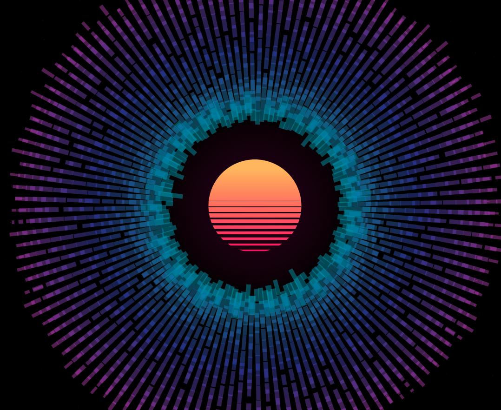

# FEW 2.5 Assignment 3 - Real time visualization
Real Time data: Audio Visualizer. 

## A vaporwave / synthwave themed audio visualization

* * *

### Live Demo
[Live project link](https://www.jonathanewarner.com/OutrunMusicVisualizer/)

## How to run locally?
  * Use a python server to serve index.html
  * Use liveServer with VScode
